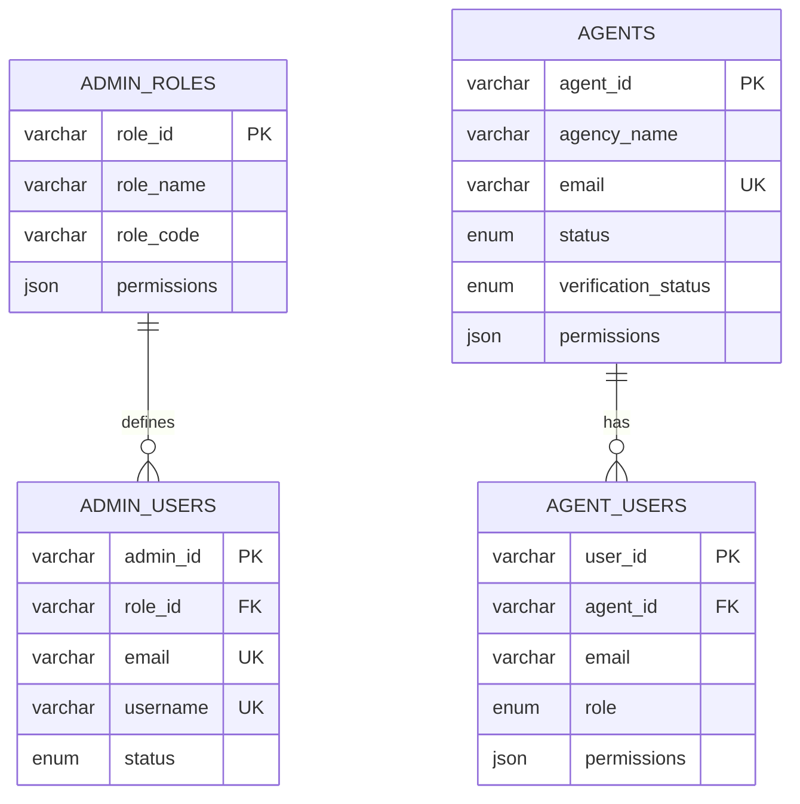
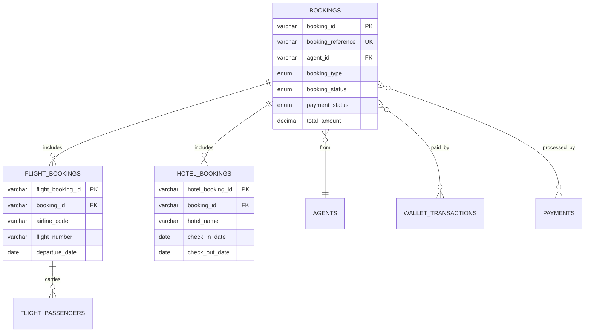
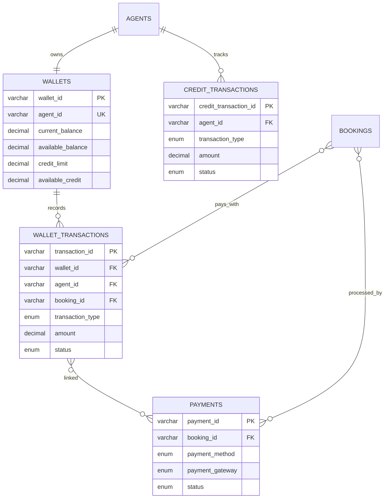
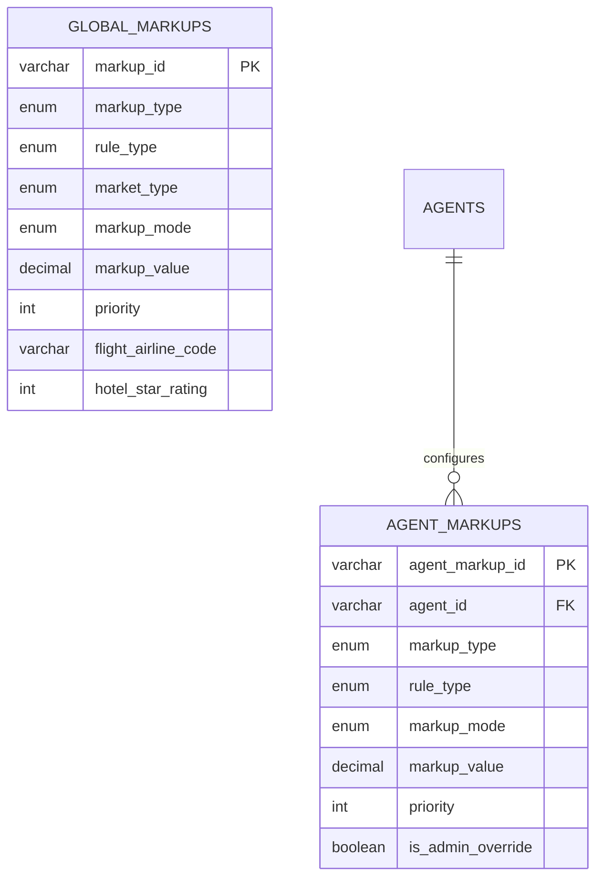

# B2B Travel Portal - Entity Relationship Diagram

## Complete ERD (Mermaid Format)

```mermaid
erDiagram
    %% ========================================
    %% AUTHENTICATION & USER MANAGEMENT
    %% ========================================

    ADMIN_ROLES ||--o{ ADMIN_USERS : "defines_role_for"
    ADMIN_ROLES {
        varchar role_id PK
        varchar role_name UK
        varchar role_code UK
        text description
        json permissions
        int hierarchy_level
        enum status
        timestamp created_at
        timestamp updated_at
    }

    ADMIN_USERS {
        varchar admin_id PK
        varchar first_name
        varchar last_name
        varchar email UK
        varchar phone
        varchar username UK
        varchar password_hash
        varchar profile_image
        varchar role_id FK
        json permissions
        enum status
        boolean email_verified
        timestamp created_at
        timestamp updated_at
        timestamp last_login_at
    }

    AGENTS ||--o{ AGENT_USERS : "has_sub_users"
    AGENTS ||--|| WALLETS : "owns"
    AGENTS ||--o{ AGENT_MARKUPS : "configures"
    AGENTS ||--o{ BOOKINGS : "makes"
    AGENTS ||--o{ WALLET_TRANSACTIONS : "has_transactions"
    AGENTS ||--o{ CREDIT_TRANSACTIONS : "has_credit_activity"
    AGENTS ||--o{ FINANCIAL_STATEMENTS : "receives"
    AGENTS {
        varchar agent_id PK
        varchar agency_name
        varchar agency_code UK
        enum business_type
        varchar contact_person_name
        varchar email UK
        varchar phone
        text address
        varchar city
        varchar state
        varchar country
        varchar postal_code
        varchar business_registration_number
        varchar tax_id
        varchar password_hash
        enum status
        enum verification_status
        decimal wallet_balance
        decimal credit_limit
        decimal available_credit
        decimal commission_rate
        boolean use_custom_markup
        json permissions
        timestamp created_at
        timestamp updated_at
        timestamp last_login_at
    }

    AGENT_USERS {
        varchar user_id PK
        varchar agent_id FK
        varchar first_name
        varchar last_name
        varchar email
        varchar username UK
        varchar password_hash
        varchar profile_image
        enum role
        json permissions
        enum status
        boolean email_verified
        timestamp created_at
        timestamp updated_at
        timestamp last_login_at
    }

    %% ========================================
    %% BOOKING MANAGEMENT
    %% ========================================

    BOOKINGS ||--o{ FLIGHT_BOOKINGS : "includes"
    BOOKINGS ||--o{ HOTEL_BOOKINGS : "includes"
    BOOKINGS }o--|| AGENT_USERS : "booked_by"
    BOOKINGS }o--o{ WALLET_TRANSACTIONS : "paid_via"
    BOOKINGS }o--o{ PAYMENTS : "processed_by"
    BOOKINGS ||--o{ CREDIT_TRANSACTIONS : "uses_credit"

    BOOKINGS {
        varchar booking_id PK
        varchar booking_reference UK
        varchar agent_id FK
        varchar booked_by_user_id FK
        enum booking_type
        varchar supplier_name
        varchar supplier_booking_reference
        varchar customer_title
        varchar customer_first_name
        varchar customer_last_name
        varchar customer_email
        varchar customer_phone
        decimal base_fare
        decimal taxes_and_fees
        decimal supplier_cost
        enum markup_type
        decimal markup_value
        decimal markup_amount
        decimal commission_rate
        decimal commission_amount
        decimal total_amount
        varchar currency
        enum payment_status
        enum payment_method
        enum booking_status
        boolean confirmation_sent
        boolean ticketed
        varchar ticket_number
        timestamp created_at
        timestamp confirmed_at
        timestamp cancelled_at
    }

    FLIGHT_BOOKINGS ||--o{ FLIGHT_PASSENGERS : "has_passengers"
    FLIGHT_BOOKINGS {
        varchar flight_booking_id PK
        varchar booking_id FK
        varchar airline_code
        varchar airline_name
        varchar flight_number
        varchar origin_airport_code
        varchar origin_airport_name
        varchar origin_city
        varchar destination_airport_code
        varchar destination_airport_name
        varchar destination_city
        date departure_date
        time departure_time
        date arrival_date
        time arrival_time
        enum cabin_class
        varchar meal_preference
        varchar seat_number
        decimal base_fare
        decimal taxes
        varchar fare_type
        varchar pnr
    }

    FLIGHT_PASSENGERS {
        varchar passenger_id PK
        varchar flight_booking_id FK
        enum title
        varchar first_name
        varchar last_name
        date date_of_birth
        enum gender
        varchar passport_number
        date passport_expiry
        varchar national_id
        varchar email
        varchar phone
        enum passenger_type
        varchar frequent_flyer_airline
        varchar frequent_flyer_number
        varchar meal_preference
        text special_requests
        boolean wheelchair_required
    }

    HOTEL_BOOKINGS {
        varchar hotel_booking_id PK
        varchar booking_id FK
        varchar hotel_id
        varchar hotel_name
        varchar hotel_chain
        int star_rating
        text address
        varchar city
        varchar state
        varchar country
        varchar postal_code
        decimal latitude
        decimal longitude
        varchar room_type
        varchar room_type_code
        int number_of_rooms
        int number_of_adults
        int number_of_children
        json child_ages
        date check_in_date
        date check_out_date
        int number_of_nights
        enum meal_plan
        json amenities
        decimal room_rate_per_night
        decimal tax_and_service_charge
        varchar supplier_confirmation_number
        text checkin_instructions
        date free_cancellation_before
        text cancellation_policy
    }

    %% ========================================
    %% FINANCIAL MANAGEMENT
    %% ========================================

    WALLETS ||--o{ WALLET_TRANSACTIONS : "records"

    WALLETS {
        varchar wallet_id PK
        varchar agent_id UK FK
        decimal current_balance
        decimal blocked_balance
        decimal available_balance
        decimal credit_limit
        decimal used_credit
        decimal available_credit
        enum status
        boolean is_credit_enabled
        boolean credit_approved
        varchar credit_approved_by
        timestamp credit_approved_at
        boolean auto_recharge_enabled
        decimal auto_recharge_threshold
        decimal auto_recharge_amount
        boolean allow_overdraft
        decimal overdraft_limit
        timestamp created_at
        timestamp updated_at
    }

    WALLET_TRANSACTIONS }o--o{ BOOKINGS : "related_to"
    WALLET_TRANSACTIONS }o--o{ PAYMENTS : "linked_to"

    WALLET_TRANSACTIONS {
        varchar transaction_id PK
        varchar wallet_id FK
        varchar agent_id FK
        varchar booking_id FK
        varchar transaction_reference UK
        enum transaction_type
        enum transaction_category
        decimal amount
        decimal opening_balance
        decimal closing_balance
        enum payment_method
        varchar payment_gateway
        varchar gateway_transaction_id
        varchar bank_name
        varchar transaction_ref_number
        varchar utr_number
        enum status
        boolean requires_approval
        varchar approved_by
        timestamp approved_at
        text rejection_reason
        varchar receipt_url
        timestamp created_at
        timestamp completed_at
    }

    CREDIT_TRANSACTIONS }o--o{ BOOKINGS : "related_to"

    CREDIT_TRANSACTIONS {
        varchar credit_transaction_id PK
        varchar agent_id FK
        varchar booking_id FK
        varchar transaction_reference UK
        enum transaction_type
        decimal amount
        decimal opening_credit
        decimal closing_credit
        decimal old_credit_limit
        decimal new_credit_limit
        enum status
        varchar approved_by
        timestamp approved_at
        date valid_till
        text notes
        timestamp created_at
    }

    PAYMENTS {
        varchar payment_id PK
        varchar booking_id FK
        varchar wallet_transaction_id FK
        varchar agent_id FK
        varchar payment_reference UK
        enum payment_type
        decimal amount
        varchar currency
        enum payment_method
        enum payment_gateway
        varchar gateway_order_id
        varchar gateway_payment_id
        varchar card_last_4_digits
        varchar card_holder_name
        varchar bank_name
        enum status
        json gateway_response
        decimal refund_amount
        varchar refund_reference
        enum refund_status
        timestamp created_at
        timestamp completed_at
    }

    %% ========================================
    %% MARKUP & PRICING
    %% ========================================

    GLOBAL_MARKUPS {
        varchar markup_id PK
        varchar markup_name
        enum markup_type
        enum rule_type
        enum market_type
        enum status
        int priority
        enum markup_mode
        decimal markup_value
        varchar flight_origin_airport_code
        varchar flight_destination_airport_code
        varchar flight_airline_code
        enum flight_cabin_class
        int hotel_star_rating
        varchar hotel_city
        enum hotel_property_type
        decimal min_booking_value
        decimal max_booking_value
        date valid_from
        date valid_to
        timestamp created_at
        timestamp updated_at
    }

    AGENT_MARKUPS {
        varchar agent_markup_id PK
        varchar agent_id FK
        varchar markup_name
        enum markup_type
        enum rule_type
        enum status
        int priority
        enum markup_mode
        decimal markup_value
        varchar flight_origin_airport_code
        varchar flight_destination_airport_code
        varchar flight_airline_code
        enum flight_cabin_class
        int hotel_star_rating
        varchar hotel_city
        enum hotel_property_type
        date valid_from
        date valid_to
        boolean is_admin_override
        timestamp created_at
        timestamp updated_at
    }

    %% ========================================
    %% REPORTS & ANALYTICS
    %% ========================================

    BOOKING_REPORTS {
        varchar report_id PK
        varchar agent_id FK
        date report_date
        enum report_type
        date period_start
        date period_end
        int total_bookings
        int flight_bookings
        int hotel_bookings
        int confirmed_bookings
        int pending_bookings
        int cancelled_bookings
        int failed_bookings
        decimal total_revenue
        decimal total_markup
        decimal total_commission
        decimal average_booking_value
        int wallet_payments
        int credit_payments
        int gateway_payments
        timestamp created_at
    }

    FINANCIAL_STATEMENTS {
        varchar statement_id PK
        varchar agent_id FK
        varchar statement_period
        date period_start
        date period_end
        decimal opening_balance
        decimal total_recharges
        decimal total_refunds
        decimal total_credits
        decimal total_bookings
        decimal total_cancellations
        decimal total_debits
        decimal total_commission_earned
        decimal total_markup_earned
        decimal adjustments
        decimal closing_balance
        decimal opening_credit
        decimal credit_used
        decimal credit_repaid
        decimal closing_credit
        enum status
        varchar statement_url
        timestamp generated_at
    }

    %% ========================================
    %% AUDIT & SYSTEM
    %% ========================================

    AUDIT_LOGS {
        varchar audit_id PK
        varchar actor_id
        enum actor_type
        varchar actor_email
        varchar action
        enum action_category
        varchar target_entity
        varchar target_id
        text action_description
        json old_values
        json new_values
        varchar ip_address
        text user_agent
        enum status
        text error_message
        timestamp created_at
    }

    SYSTEM_LOGS {
        varchar log_id PK
        enum log_level
        varchar log_category
        text message
        json details
        varchar request_id
        varchar user_id
        varchar user_type
        varchar exception_class
        text exception_message
        text stack_trace
        timestamp created_at
    }

    %% ========================================
    %% NOTIFICATIONS & SETTINGS
    %% ========================================

    NOTIFICATIONS {
        varchar notification_id PK
        varchar recipient_id
        enum recipient_type
        varchar title
        text message
        enum notification_type
        varchar reference_type
        varchar reference_id
        boolean is_read
        timestamp read_at
        boolean sent_via_email
        boolean sent_via_sms
        boolean sent_via_push
        timestamp created_at
    }

    SYSTEM_SETTINGS {
        varchar setting_id PK
        varchar setting_key UK
        text setting_value
        enum setting_type
        varchar category
        text description
        boolean is_editable
        timestamp created_at
        timestamp updated_at
    }
```

---

## Module-wise ERDs

### 1. Authentication & User Management



---

### 2. Booking Flow



---

### 3. Financial System



---

### 4. Markup Configuration



---

### 5. Admin Management

```mermaid
erDiagram
    ADMIN_ROLES ||--o{ ADMIN_USERS : "assigns"

    ADMIN_ROLES {
        varchar role_id PK
        varchar role_name
        varchar role_code
        json permissions
        int hierarchy_level
    }

    ADMIN_USERS {
        varchar admin_id PK
        varchar role_id FK
        varchar email UK
        json permissions
        enum status
    }

    ADMIN_USERS ||--o{ AGENTS : "manages"
    ADMIN_USERS ||--o{ WALLET_TRANSACTIONS : "approves"
    ADMIN_USERS ||--o{ GLOBAL_MARKUPS : "configures"
    ADMIN_USERS ||--o{ AGENT_MARKUPS : "overrides"
}
```

---

## Relationship Matrix

| Table | To | Relationship | Cardinality |
|-------|-----|--------------|-------------|
| **ADMIN_ROLES** | ADMIN_USERS | defines role for | 1:N |
| **AGENTS** | AGENT_USERS | has sub-users | 1:N |
| **AGENTS** | WALLETS | owns | 1:1 |
| **AGENTS** | BOOKINGS | makes | 1:N |
| **AGENTS** | AGENT_MARKUPS | configures | 1:N |
| **AGENTS** | WALLET_TRANSACTIONS | has transactions | 1:N |
| **AGENTS** | CREDIT_TRANSACTIONS | has credit activity | 1:N |
| **AGENTS** | FINANCIAL_STATEMENTS | receives | 1:N |
| **BOOKINGS** | FLIGHT_BOOKINGS | includes | 1:N |
| **BOOKINGS** | HOTEL_BOOKINGS | includes | 1:N |
| **BOOKINGS** | WALLET_TRANSACTIONS | paid via | N:1 |
| **BOOKINGS** | PAYMENTS | processed by | N:1 |
| **BOOKINGS** | CREDIT_TRANSACTIONS | uses credit | N:1 |
| **FLIGHT_BOOKINGS** | FLIGHT_PASSENGERS | has passengers | 1:N |
| **WALLETS** | WALLET_TRANSACTIONS | records | 1:N |
| **WALLET_TRANSACTIONS** | PAYMENTS | linked to | N:1 |
| **ADMIN_USERS** | AGENTS | manages | 1:N |
| **ADMIN_USERS** | WALLET_TRANSACTIONS | approves | 1:N |
| **ADMIN_USERS** | CREDIT_TRANSACTIONS | approves | 1:N |

---

## Key Constraints

### Primary Keys (PK)
- All tables use `VARCHAR(36)` UUIDs as primary keys
- Format: Random UUIDs (e.g., `550e8400-e29b-41d4-a716-446655440000`)

### Foreign Keys (FK)
- All foreign keys reference primary keys
- ON DELETE CASCADE for dependent records
- ON UPDATE CASCADE for reference integrity

### Unique Keys (UK)
| Table | Unique Fields |
|-------|---------------|
| AGENTS | email, agency_code |
| AGENT_USERS | username, (agent_id, email) |
| ADMIN_USERS | email, username |
| BOOKINGS | booking_reference |
| WALLET_TRANSACTIONS | transaction_reference |
| CREDIT_TRANSACTIONS | transaction_reference |
| PAYMENTS | payment_reference |
| ADMIN_ROLES | role_name, role_code |
| WALLETS | agent_id |

---

## Index Strategy

### Clustered Indexes
- All tables use PRIMARY KEY as clustered index

### Non-Clustered Indexes

#### High-Query Tables
| Table | Indexes |
|-------|---------|
| BOOKINGS | agent_id, booking_reference, booking_status, payment_status, created_at |
| WALLET_TRANSACTIONS | wallet_id, agent_id, transaction_type, created_at |
| AGENTS | email, agency_code, status |

#### Composite Indexes
| Table | Composite Index |
|-------|-----------------|
| BOOKINGS | (agent_id, created_at, booking_status) |
| WALLET_TRANSACTIONS | (agent_id, created_at, transaction_type) |
| FLIGHT_BOOKINGS | (booking_id, departure_date) |

---

## Data Volume Estimates

| Table | Estimated Records/Month | Growth Rate |
|-------|------------------------|-------------|
| BOOKINGS | 10,000 - 50,000 | High |
| WALLET_TRANSACTIONS | 20,000 - 100,000 | Very High |
| FLIGHT_PASSENGERS | 30,000 - 150,000 | Very High |
| AUDIT_LOGS | 100,000 - 500,000 | Extreme |
| SYSTEM_LOGS | 200,000 - 1,000,000 | Extreme |

**Recommendation**: Implement partitioning for AUDIT_LOGS, SYSTEM_LOGS, and BOOKINGS tables by date.

---

## Normalization Level

**Current Design**: BCNF (Boyce-Codd Normal Form)

### Normalization Applied:
- ✅ **1NF**: All atomic values, no repeating groups
- ✅ **2NF**: No partial dependencies (all non-key attributes depend on entire PK)
- ✅ **3NF**: No transitive dependencies
- ✅ **BCNF**: Every determinant is a candidate key

### Denormalization Applied (for performance):
- `agency_name` in BOOKINGS (avoid join to AGENTS for listing)
- `airline_name` in FLIGHT_BOOKINGS (avoid lookup)
- `current_balance` stored in WALLETS (real-time access)
- Aggregated fields in BOOKING_REPORTS (pre-computed)

---

## Migration Path

### Phase 1: Core Tables
```sql
-- Order of creation
1. ADMIN_ROLES
2. ADMIN_USERS
3. AGENTS
4. AGENT_USERS
5. WALLETS
6. SYSTEM_SETTINGS
```

### Phase 2: Financial Tables
```sql
7. WALLET_TRANSACTIONS
8. CREDIT_TRANSACTIONS
9. PAYMENTS
10. FINANCIAL_STATEMENTS
```

### Phase 3: Booking Tables
```sql
11. BOOKINGS
12. FLIGHT_BOOKINGS
13. FLIGHT_PASSENGERS
14. HOTEL_BOOKINGS
```

### Phase 4: Configuration & Reports
```sql
15. GLOBAL_MARKUPS
16. AGENT_MARKUPS
17. BOOKING_REPORTS
```

### Phase 5: Audit & System
```sql
18. AUDIT_LOGS
19. SYSTEM_LOGS
20. NOTIFICATIONS
```

---

## ERD Rendering Tools

### Recommended Tools:
1. **Mermaid Live Editor** - https://mermaid.live
2. **dbdiagram.io** - Import as Mermaid syntax
3. **Draw.io** - Manual recreation
4. **MySQL Workbench** - Reverse engineer from SQL
5. **DBeaver** - ER diagram visualization
6. **DataGrip** - JetBrains ER diagrams

### Online Viewing:
- Paste the Mermaid code into https://mermaid.live
- Export as SVG/PNG for documentation
- Interactive HTML output available

---

## Summary

| Metric | Value |
|--------|-------|
| **Total Entities** | 20 |
| **Total Relationships** | 30+ |
| **Primary Keys** | 20 |
| **Foreign Keys** | 35+ |
| **Unique Constraints** | 15+ |
| **Indexes** | 50+ |
| **Normalization** | BCNF |
| **Est. Table Count** | 20 |
| **Est. Total Columns** | 400+ |

---

**Next Steps:**
1. Review and approve the ERD
2. Generate SQL scripts from this design
3. Create ORM models (Sequelize/TypeORM/Prisma)
4. Set up database migration files
5. Generate API endpoints based on schema
